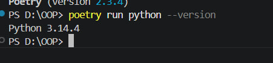
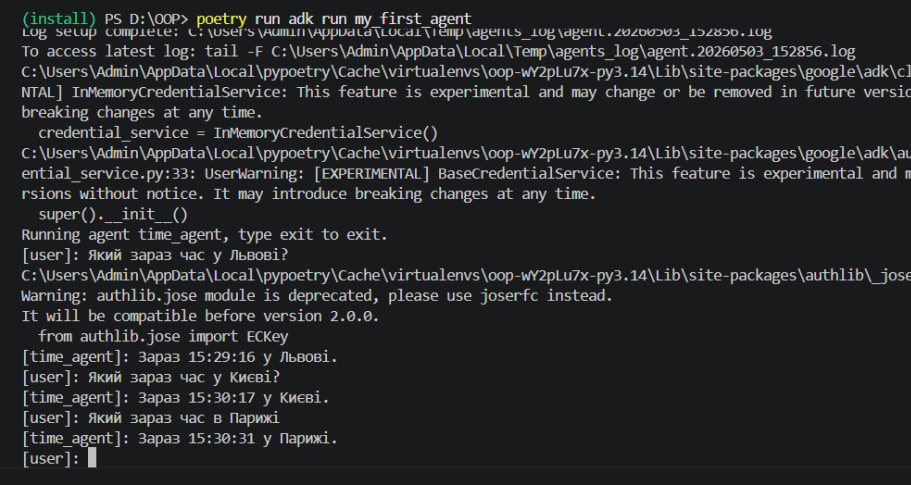
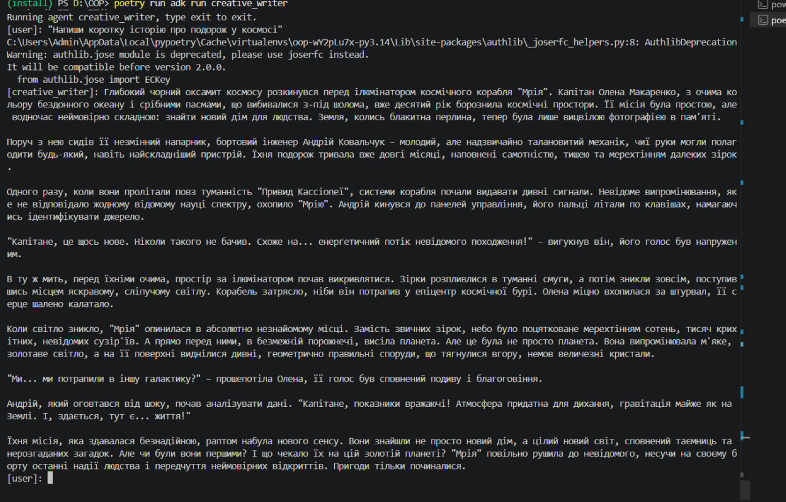
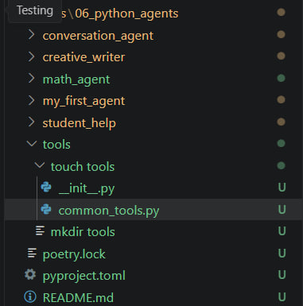

Звіт про виконання лабораторної роботи: "Розробка AI Агентів за допомогою Google ADK та Python"
Тема дослідження

Проєктування та практична реалізація автономних AI-агентів на базі інструментарію Google Agent Development Kit (ADK) в екосистемі Python із використанням менеджера залежностей Poetry.
Мета роботи

Глибоке освоєння архітектури AI-агентів, опанування механізму інтеграції сторонніх інструментів (Tools) та взаємодії з моделями лінійки Gemini. Формування навичок управління контекстом (пам'яттю) розмови та побудови складних агентних робочих процесів (Workflows).
Технологічний стек

    Мова програмування: Python 3.13+

    Керування залежностями: Poetry

    Ядро розробки: Google ADK

    Мовна модель (LLM): Gemini API

    Допоміжні бібліотеки: python-dotenv (для безпечного керування змінними оточення)

Налаштування робочого середовища

Для перевірки готовності системи до роботи було виконано аудіт версій базового софту:
Bash

python --version
poetry --version

Ініціалізація проєкту та встановлення пакетів

Створення конфігураційних файлів та розгортання необхідних бібліотек через ізольоване середовище Poetry:
Bash

poetry init
poetry add google-adk python-dotenv

Детальний огляд розроблених AI-агентів
1. Time Agent (Тайм-агент)

    Призначення: Надання точної інформації про поточний час у зазначеному мегаполісі.

    Інструмент (Tool): Функція get_current_time(city), яка використовує стандартну бібліотеку datetime для симуляції або розрахунку часу.

    Особливість реалізації: Демонструє базове використання класу Agent як фундаментального компонента для підключення до LLM Gemini та реєстрації найпростіших функцій-інструментів.

(ВСТАВИТИ СКРІНШОТ 3: Код ініціалізації Time Agent та функції get_current_time)

2. Math Agent (Математичний помічник)

    Призначення: Проведення точних геометричних та алгебраїчних розрахунків, де нейромережі зазвичай роблять галюцинації (помилки в цифрах).

    Базовий функціонал: Розрахунок площі прямокутника, площі кола та кубічного об'єму.

    Розширення (Власна модифікація): Було інтегровано інструмент для обчисленого об'єму циліндра.

Python

import math

def calculate_cylinder_volume(radius: float, height: float) -> str | float:
    """
    Об can обчислити об'єм циліндра за заданим радіусом та висотою.
    
    :param radius: Радіус основи циліндра
    :param height: Висота циліндра
    :return: Значення об'єму (округлене) або повідомлення про помилку
    """
    if radius < 0 or height < 0:
        return "Помилка: лінійні розміри не можуть бути від'ємними."
    
    volume = math.pi * pow(radius, 2) * height
    return round(volume, 2)

# Тестова верифікація функції
r, h = 5, 10
print(f"Тестовий об'єм циліндра (r={r}, h={h}): {calculate_cylinder_volume(r, h)}")

3. Student Helper (Ментор-асистент)

    Призначення: Інтерактивне навчання програмуванню та розбір коду.

    Інструменти: explain_concept() (детальний розбір теорії) та check_syntax() (валідація синтаксису Python).

    Стиль взаємодії: Агент налаштований відповідати у лаконічній форме без надмірної академічної сухості, генеруючи корисні приклади коду "на льоту".

4. Creative Writer (Генератор художнього контенту)

    Призначення: Створення текстових сюжетів, креативних історій та сценаріїв.

    Специфіка конфігурації: Для підвищення оригінальності та гнучкості відповідей LLM було застосовано спеціальні параметри генерації:

        temperature = 1.5 (високий рівень непередбачуваності та творчості)

        top_k = 40 (обмеження вибору наступного слова топ-40 варіантами)

        top_p = 0.95 (динамічний відбір слів за сумарною ймовірністю)

5. Conversation Agent (Діалоговий агент з пам'яттю)

    Призначення: Утримання персоналізованого контексту в межах однієї сесії.

    Інструменти: save_user_preference() та recall_preference().

    Результат: Модель здатна запам'ятовувати ім'я користувача, його інтереси, колірні вподобання чи хобі, адаптуючи подальші репліки під зібраний профіль.

6. Stateful Agent (Персистентний агент)

    Призначення: Довготривале збереження фактів.

    Інструменти: remember_fact() та recall_fact().

    Головна відмінність від звичайного діалогового агента: Дані не просто тримаються в оперативній пам'яті сесії, а серіалізуються у фізичний JSON-файл на диску. Завдяки цьому агент не забуває інформацію навіть після повного перезапуску скрипта чи комп'ютера.

7. Власний агент (Safe Math Agent)

В межах індивідуального завдання було спроєктовано агента з підвищеним рівнем обробки виняткових ситуацій (строга валідація даних перед обчисленням).
Python

from google.adk.agents.llm_agent import Agent

def safe_divide(a: float, b: float) -> dict:
    """Виконує безпечне ділення двох дійсних чисел з превентивним захистом від ZeroDivisionError."""
    if b == 0:
        return {"error": "Критична помилка: спроба ділення на нуль!", "result": None}
    return {"result": a / b, "error": None}

def calculate_average(numbers: list[float]) -> dict:
    """Математично коректно обчислює середнє арифметичне для переданого масиву чисел."""
    if not numbers:
        return {"error": "Помилка: передано порожній масив чисел.", "result": None}

    return {
        "result": sum(numbers) / len(numbers),
        "error": None
    }

# Ініціалізація та кастомізація системного промпту агента
root_agent = Agent(
    model="gemini-2.5-flash",
    name="safe_math_agent",
    description="Спеціалізований агент для проведення безпомилкових математичних операцій.",
    instruction="""
Ти — професійний математичний аналітик.

Твої правила:
1. Завжди піддавай валідації вхідні аргументи (числа).
2. Для виконання будь-яких математичних дій обов'язково викликай відповідні інструменти (tools).
3. Веди діалог виключно українською мовою.
4. Фінальну відповідь пояснюй доступно, розжовуючи логіку розрахунку.
5. У разі виникнення помилок (переданих інструментом) детально опиши користувачу, що пішло не так.

Формат виведення структури відповіді:
- [Обчислений Результат]
- [Аналітичне Пояснення]
""",
    tools=[safe_divide, calculate_average],
)

notes/06_python_agents/
├── my_first_agent/
│   ├── agent.py
│   ├── .env
│   └── __init__.py
├── math_agent/
│   ├── agent.py
│   ├── .env
│   └── __init__.py
├── student_helper/
│   ├── agent.py
│   ├── .env
│   └── __init__.py
├── creative_writer/
│   └── ...
├── conversation_agent/
│   └── ...
├── stateful_agent/
│   └── ...
├── tools/
│   ├── __init__.py
│   └── common_tools.py
├── pyproject.toml
├── poetry.lock
└── README.md

В ході лабораторної роботи було проаналізовано три фундаментальні архітектурні патерни організації роботи агентів:

[Sequential]  Крок 1 (Аналіз)  ──>  Крок 2 (Виконання) ──> Крок 3 (Результат)

[Loop]        Завдання ──> Виконання ──> Перевірка якості ──(Незадовільно)──┐
                 ▲                                                          │
                 └──────────────────────────────────────────────────────────┘
                 (Задовільно) ──> Вихід (exit_loop)

[Parallel]    Завдання ──┬──> Агент А (Задача 1) ──┬──> Агрегація результатів
                         ├──> Агент Б (Задача 2) ──┤
                         └──> Агент В (Задача 3) ──┘

    Sequential (Послідовний): Суворе лінійне виконання ланцюжка задач за схемою: Аналіз вхідних даних -> Викликання інструментів -> Формування фінальної відповіді.

        Перевага: Ідеальний контроль над кожним етапом обробки.

    Loop (Циклічний): Агент ітеративно повторює дії та аналізує проміжний результат, доки якість виконання не задовольнить критерії виходу (тригерується функція exit_loop).

        Перевага: Автоматичне виправлення власних помилок (Self-correction).

    Parallel (Паралельний): Розпаралелювання незалежних підзадач між кількома агентами чи інструментами одночасно.

        Перевага: Максимальна швидкість обробки великих масивів інформації.

Практичне тестування системи

Результати взаємодії з агентами продемонстрували повну відповідність закладеним інструкціям:

    Time Agent: Коректно парсить назви міст і повертає динамічний час у форматі HH:MM:SS.

    Math Agent: Точно рахує складні вирази через виклик функцій.

    Student Helper: Генерує чіткі дорожні карти для вивчення складних концепцій Python (List comprehensions, замикання, ООП) з дебагом синтаксичних помилок користувача.

Висновки

У результаті виконання лабораторної роботи було здобуто практичні навички у сфері Agentic AI:

    Опановано принципи побудови LLM-агентів за допомогою фреймворку Google ADK.

    Реалізовано механізм розширення можливостей моделей через Tools (передачу Python-функцій як інструментів виконання).

    Досліджено методи конфігурації поведінки ШІ за допомогою системних інструкцій та параметрів креативності (temperature, top_p).

    На практиці реалізовано агентні архітектури з довготривалою пам'яттю (із застосуванням файлової персистенції через JSON).

    Вивчено відмінності між основними типами агентних Workflows (Sequential, Loop, Parallel) для оптимізації виконання комплексних бізнес-процесів.