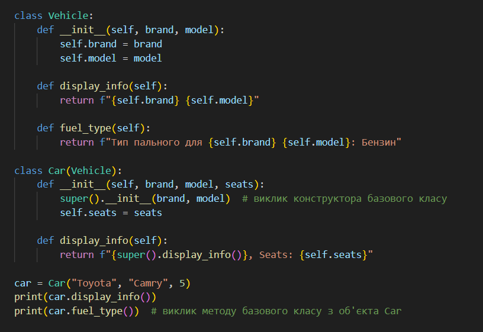
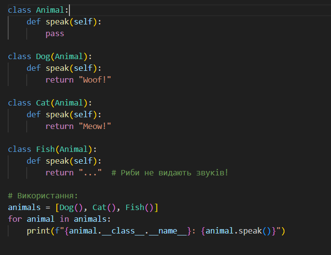
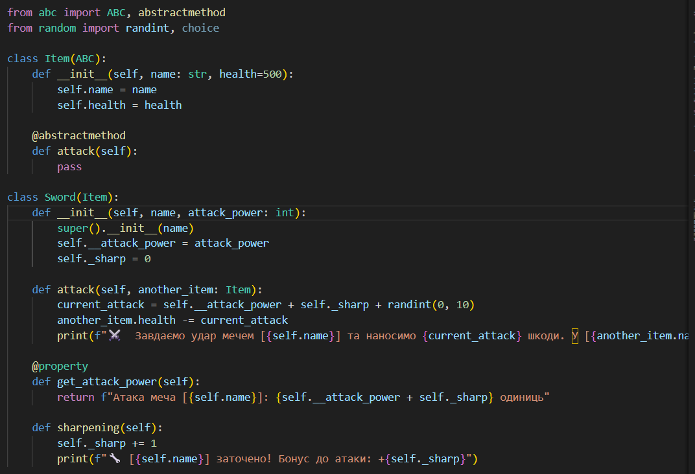
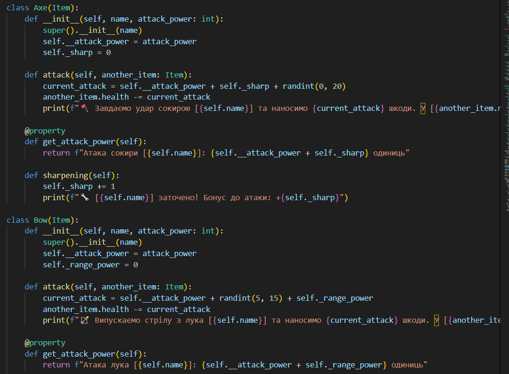
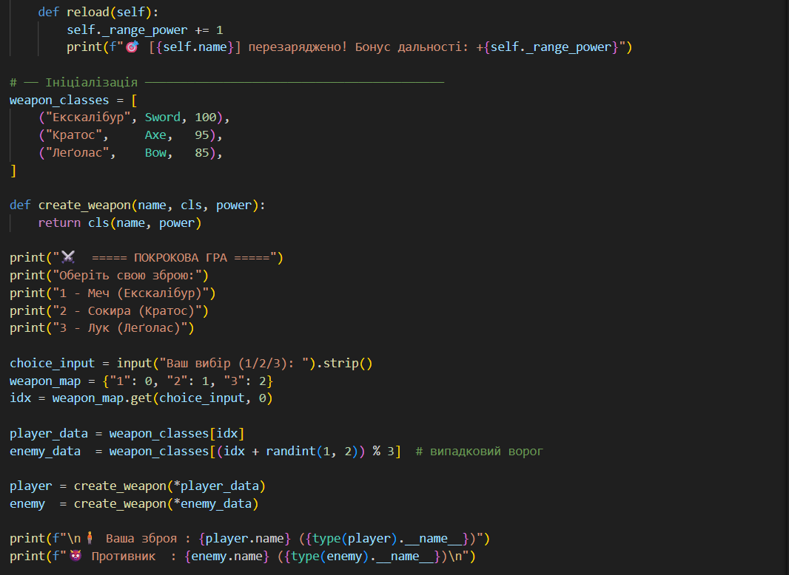
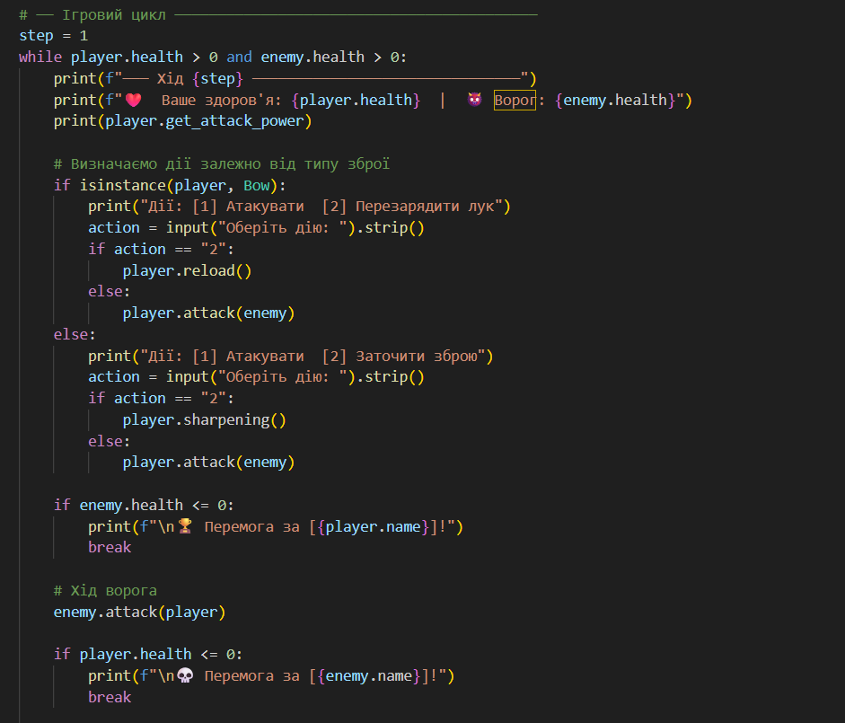

Звіт до роботи
Тема: Основні парадигми ООП
Мета роботи: Ознайомитись з ключовими поняттями об’єктно-орієнтованого програмування (ООП) у Python та навчитися реалізовувати їх у власних класах на прикладі ігрової симуляції.

Виконання роботи: Результати виконання завдання 1–4:
Висновок про виконану роботу

    Реалізація архітектури: Було спроєктовано та розроблено програмну структуру, що базується на чотирьох фундаментальних принципах об’єктно-орієнтованого програмування.

    Аналіз результатів: Програма успішно пройшла тестування, продемонструвавши коректну роботу кожного модуля. Зокрема, було отримано наступні дані:

        Динамічну зміну балансу банківського рахунку;

        Деталізовані технічні характеристики транспортних засобів;

        Поліморфну реалізацію звуків різних представників тваринного світу;

        Інтерактивну покрокову бойову симуляцію між ігровими об'єктами.

    Набуті навички: У ході виконання завдання було закріплено практичні навички роботи з інкапсуляцією (захист даних), наслідуванням (створення ієрархій), поліморфізмом (гнучкість методів) та абстракцією (використання абстрактних класів).

    Документація:

        До звіту додано графічні підтвердження (скріншоти) роботи програми;

        Нижче наведено повний вихідний код проєкту.
1.

2.

3.

4.

Висновок:

    Що зроблено в роботі: реалізовано 4 парадигми ООП на Python
    Чи досягнуто мету роботи: так
    Які нові знання отримано: навчились писати класи, використовувати super(), ABC, @abstractmethod, @property
    Чи вдалось виконати всі завдання: так
