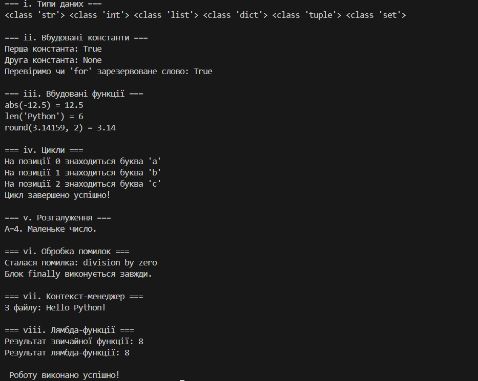

Тема: Основи програмування на Python

Мета роботи: Навчитись застосовувати основні конструкції мови Python: змінні, типи даних, оператори розгалужень, цикли, обробку винятків, контекст-менеджери та лямбда-функції.

Результати виконання завдання:

Розробили / створили:
Python-файл lab4_Yemanov.py, у якому продемонстровано основні конструкції мови Python.

Програма вивела значення:

Типи даних (int, float, list, tuple, dict, set)

Результати виконання вбудованих функцій (abs, len, round)

Результати циклів і розгалужень

Повідомлення при обробці помилки (try-except-finally)

Роботу з файлом через with open()

Приклади звичайних і лямбда-функцій

Отримано наступні результати:
Усі частини коду успішно виконані без помилок. Програма створює файл test.txt, читає його, демонструє роботу циклів, умов і лямбда-функцій.

Навчились:

1.Створювати змінні різних типів даних
2.Користуватись вбудованими функціями
3.Писати прості цикли та умови
4.Обробляти помилки під час виконання
5.Працювати з файлами у Python
6.Використовувати лямбда-функції

Висновок

Що зроблено в роботі:
Виконано практичне завдання з програмування мовою Python. Створено програму, яка демонструє використання базових конструкцій, операторів, циклів і функцій.

Чи досягнуто мети роботи:
Так, мети роботи досягнуто — отримано практичні навички написання та налагодження Python-програм.

Які нові знання отримано:
Закріплено знання про типи даних, логічні вирази, цикли, умовні оператори, лямбда-функції та структуру Python-коду.

Чи вдалося відповісти на всі питання, задані в ході роботи:
Так, усі поставлені питання опрацьовано та зрозуміло.

Чи вдалося виконати всі завдання:
Так, усі етапи роботи виконано повністю.

Чи виникли складнощі у виконанні завдання:
Незначні труднощі виникали під час тестування коду, але були вирішені шляхом перевірки синтаксису та логіки виконання.

Чи подобається такий формат здачі роботи:
Так, формат зручний, структурований і зрозумілий.

Побажання для покращення :
Можна додати більше прикладів для самостійного розбору або практичні тести після кожного розділу.

