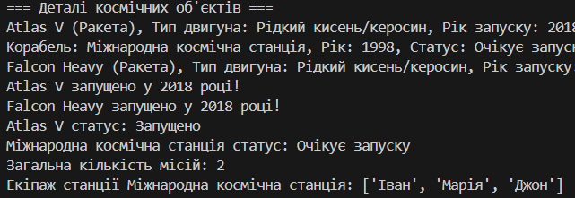
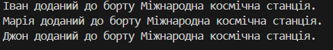

Звіт до роботи

Тема: Моделювання космічних об'єктів за допомогою об'єктно-орієнтованого програмування на Python

Мета роботи: Створити програму, яка моделює космічні об'єкти (космічний корабель, станція, ракета, астронавт) із використанням класів, приватних атрибутів, статичних методів та комірок (об'єктів). Навчитися працювати з OOP, створювати складні структури та виконувати дії з об'єктами.

Виконання роботи:

    Розробили класи для моделювання космічних об'єктів:
        Базовий клас Spacecraft, що зберігає дані про запуск та підрахунок місій.
        Похідні класи SpaceStation та Rocket, які мають додаткові атрибути та методи.
        Клас Astronaut для збереження інформації про астронавтів.
    Створили об'єкти (комірки) для ракет, станції та астронавтів.
    Реалізували функції додавання астронавтів до станції, запуску ракет, підрахунку загальної кількості місій.
    Вивели на екран інформацію про створені об'єкти, статуси, список екіпажу, результати запуску.
    Навчились працювати із приватними атрибутами, використовувати статичні методи для підрахунку.

Результати виконання:

    Створено та протестовано класи та об'єкти.
    Виконані операції додавання астронавтів, запуску ракет, отримання статусів.
    Підраховано кількість місій за допомогою статичного методу.
    Виведено результати у консоль у вигляді інформаційних повідомлень та списків.

Рисунки і результати:

Питання-відповіді:

    Що зроблено в роботі?
        Створено класи для моделювання космічних об'єктів та об'єктів-комірок, реалізовано їх взаємодію та функціонал.

    Чи досягнуто мети роботи?
        Так, поставлена мета – створити програму для моделювання космічних об'єктів, досягнута.

    Які нові знання отримано?
        Навчились працювати з об'єктно-орієнтованим програмуванням, приватними атрибутами, статичними методами, створювати складні структури.

    Чи вдалося відповісти на всі питання, поставлені в ході роботи?
        Так, всі питання були опрацьовані та реалізовані.

    Чи вдалося виконати всі завдання?
        Так, всі заплановані функції реалізовані.

    Чи виникли складнощі у виконанні завдання?
        Можливо, найбільша складність полягала у правильному використанні приватних атрибутів та статичних методів.

    Чи подобається такий формат здачі роботи (Feedback)?
        Так, формат з коментарями, кодом і поясненнями зручний та зрозумілий.

    Побажання для покращення:
        Можливо додати графічний інтерфейс або збереження даних у файли для більшої інтерактивності та зручності.
